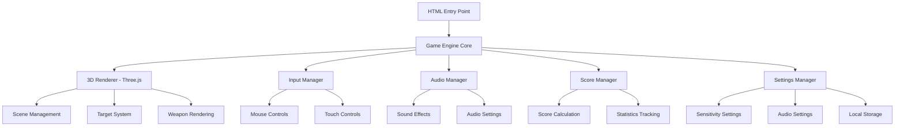

# Design Document

## Overview

The 3D Aim Trainer is a pure frontend web application built using Three.js for 3D rendering, vanilla JavaScript for game logic, and modern web APIs for audio and input handling. The application provides an immersive 3D environment where users can practice aiming with a USP pistol, featuring real-time scoring, customizable settings, and optimized performance across different devices.

## Architecture

### High-Level Architecture



### Technology Stack

- **3D Rendering**: Three.js (WebGL-based 3D library)
- **Build Tool**: Vite (for fast development and optimized builds)
- **Deployment**: Vercel (static site hosting)
- **Audio**: Web Audio API
- **Storage**: localStorage (for settings persistence)
- **Styling**: CSS3 with CSS Grid/Flexbox
- **Module System**: ES6 modules

## Components and Interfaces

### Core Game Engine

```javascript
class GameEngine {
  constructor()
  init()
  start()
  pause()
  resume()
  stop()
  update(deltaTime)
  render()
}
```

**Responsibilities:**
- Coordinate all game systems
- Manage game state (menu, playing, paused, ended)
- Handle main game loop
- Orchestrate updates between components

### 3D Renderer Component

```javascript
class Renderer {
  constructor(canvas)
  initScene()
  initCamera()
  initLights()
  render()
  resize(width, height)
  dispose()
}
```

**Responsibilities:**
- Manage Three.js scene, camera, and renderer
- Handle window resizing and viewport adjustments
- Optimize rendering performance
- Manage 3D assets and materials

### Target System

```javascript
class TargetManager {
  constructor(scene)
  spawnTarget(position)
  removeTarget(target)
  checkHit(raycast)
  updateTargets(deltaTime)
  getActiveTargets()
}

class Target {
  constructor(position, size)
  update(deltaTime)
  onHit()
  destroy()
}
```

**Responsibilities:**
- Spawn and manage target lifecycle
- Handle hit detection via raycasting
- Animate targets (optional movement patterns)
- Provide visual feedback for hits/misses

### Input Manager

```javascript
class InputManager {
  constructor(canvas)
  bindEvents()
  getMousePosition()
  isClicking()
  getSensitivity()
  setSensitivity(value)
}
```

**Responsibilities:**
- Handle mouse movement and clicks
- Apply sensitivity settings
- Support both desktop and mobile inputs
- Provide normalized input coordinates

### Audio Manager

```javascript
class AudioManager {
  constructor()
  loadSounds()
  playSound(soundName, volume)
  setMasterVolume(volume)
  toggleAudio(enabled)
  preloadAssets()
}
```

**Responsibilities:**
- Manage audio assets and playback
- Handle volume controls and audio toggle
- Optimize audio loading and memory usage
- Provide spatial audio effects (optional)

### Score Manager

```javascript
class ScoreManager {
  constructor()
  addHit(accuracy, timeBonus)
  addMiss()
  getScore()
  getAccuracy()
  getStatistics()
  reset()
}
```

**Responsibilities:**
- Calculate and track scoring
- Maintain accuracy statistics
- Provide real-time performance metrics
- Generate end-of-session summaries

### Settings Manager

```javascript
class SettingsManager {
  constructor()
  loadSettings()
  saveSettings()
  getSetting(key)
  setSetting(key, value)
  resetToDefaults()
}
```

**Responsibilities:**
- Manage user preferences
- Handle localStorage persistence
- Provide default values
- Validate setting ranges

## Data Models

### Game State

```javascript
const GameState = {
  MENU: 'menu',
  PLAYING: 'playing',
  PAUSED: 'paused',
  ENDED: 'ended'
}
```

### Target Data

```javascript
class TargetData {
  id: string
  position: Vector3
  size: number
  spawnTime: number
  isActive: boolean
  hitTime: number | null
}
```

### Score Data

```javascript
class ScoreData {
  totalScore: number
  hits: number
  misses: number
  accuracy: number
  sessionTime: number
  bestStreak: number
  currentStreak: number
}
```

### Settings Data

```javascript
class SettingsData {
  mouseSensitivity: number // 0.1 - 5.0
  audioEnabled: boolean
  masterVolume: number // 0.0 - 1.0
  targetSize: number // future expansion
  difficulty: string // future expansion
}
```

## Error Handling

### WebGL Support Detection

```javascript
function checkWebGLSupport() {
  try {
    const canvas = document.createElement('canvas')
    const gl = canvas.getContext('webgl') || canvas.getContext('experimental-webgl')
    return !!gl
  } catch (e) {
    return false
  }
}
```

### Graceful Degradation Strategy

1. **WebGL Not Supported**: Display informative message with browser upgrade suggestions
2. **Audio Context Issues**: Continue without audio, show audio disabled notification
3. **Performance Issues**: Automatically reduce rendering quality, show performance warning
4. **Asset Loading Failures**: Provide fallback assets or simplified visuals

### Error Boundaries

- Wrap critical components in try-catch blocks
- Implement error reporting for debugging
- Provide user-friendly error messages
- Maintain application stability during errors

## Testing Strategy

### Unit Testing

**Target Components:**
- ScoreManager calculation logic
- SettingsManager persistence
- InputManager sensitivity calculations
- TargetManager hit detection algorithms

**Testing Framework:** Jest with jsdom for DOM simulation

### Integration Testing

**Test Scenarios:**
- Complete gameplay session flow
- Settings persistence across sessions
- Audio system integration
- Performance under load

### Performance Testing

**Metrics to Monitor:**
- Frame rate consistency (target: 60 FPS, minimum: 30 FPS)
- Memory usage over extended sessions
- Asset loading times
- Input latency measurements

### Cross-Browser Testing

**Target Browsers:**
- Chrome (latest 2 versions)
- Firefox (latest 2 versions)
- Safari (latest 2 versions)
- Edge (latest 2 versions)

**Mobile Testing:**
- iOS Safari
- Android Chrome
- Touch input responsiveness

### Automated Testing Pipeline

1. **Build Verification**: Ensure clean builds without errors
2. **Unit Test Execution**: Run all unit tests
3. **Performance Benchmarks**: Automated performance regression testing
4. **Deployment Testing**: Verify Vercel deployment functionality

## Performance Optimization

### Rendering Optimizations

- **Object Pooling**: Reuse target objects to reduce garbage collection
- **Frustum Culling**: Only render objects visible to camera
- **Level of Detail (LOD)**: Reduce geometry complexity for distant objects
- **Texture Optimization**: Use compressed textures and appropriate resolutions

### Memory Management

- **Asset Disposal**: Properly dispose of Three.js objects
- **Texture Caching**: Reuse textures across similar objects
- **Audio Buffer Management**: Preload and cache audio efficiently
- **Garbage Collection**: Minimize object creation in game loop

### Loading Optimizations

- **Asset Preloading**: Load critical assets during initialization
- **Progressive Loading**: Load non-critical assets in background
- **Compression**: Use gzip/brotli compression for assets
- **CDN Integration**: Leverage Vercel's CDN for asset delivery

### Adaptive Quality Settings

```javascript
class PerformanceMonitor {
  constructor()
  measureFrameRate()
  adjustQuality()
  getRecommendedSettings()
}
```

**Quality Levels:**
- **High**: Full effects, high-resolution textures, complex geometry
- **Medium**: Reduced effects, medium textures, simplified geometry
- **Low**: Minimal effects, low textures, basic geometry

## Deployment Architecture

### Build Process

1. **Asset Optimization**: Compress textures, audio files, and 3D models
2. **Code Bundling**: Use Vite to create optimized JavaScript bundles
3. **Static Generation**: Generate static HTML, CSS, and JS files
4. **Asset Hashing**: Add content hashes for cache busting

### Vercel Configuration

```json
{
  "buildCommand": "npm run build",
  "outputDirectory": "dist",
  "framework": "vite"
}
```

### Performance Monitoring

- **Core Web Vitals**: Monitor LCP, FID, and CLS metrics
- **Custom Metrics**: Track game-specific performance indicators
- **Error Tracking**: Monitor and log client-side errors
- **Usage Analytics**: Track user engagement and session duration